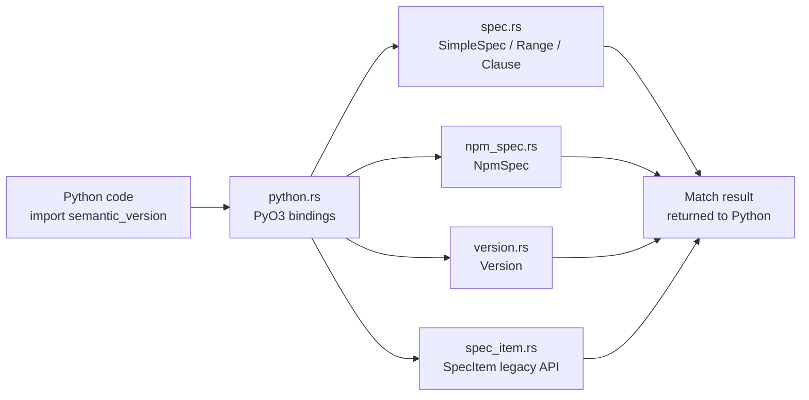

# semver-rs

A Rust port of [`rbarrois/python-semanticversion`](https://github.com/rbarrois/python-semanticversion), exposed back to Python via [PyO3](https://pyo3.rs) as a drop-in replacement — same import name, same API, Rust-backed implementation underneath.

Built for **Port_Mortem 2026** (Track D: Python → Rust).

Original project licensed BSD-2-Clause; see [THIRD_PARTY_LICENSE](./THIRD_PARTY_LICENSE).

## Why this exists

`semantic-version` is a small, pure-Python library for parsing, comparing, and matching semver version strings and range expressions (`>=1.2.0,<2.0.0`, npm-style `^1.2.3`, etc.). This project ports its core logic to Rust and wraps it so existing Python code can swap in the Rust implementation with zero code changes — `import semantic_version` resolves to this package.

## Proof of equivalence

Two independent forms of evidence back the claim that this port behaves identically to the original:

**1. The original library's own test suite, run unmodified against this Rust implementation**

```
49 passed, 5 xfailed in 0.74s
```

The 5 `xfailed` cases are documented, deliberate scope cuts (not silent gaps) — see [DECISIONS.md](./DECISIONS.md). The original test files live in `tests/original/`, copied verbatim at kickoff and SHA-256-hashed (`tests/original/HASHES.txt`) so they can never be quietly edited to make tests pass.

**2. A differential fuzz harness comparing this port against the real PyPI package**

```
2000 cases, 2000 matches, 0 mismatches
```

`scripts/differential_fuzz.py` generates random version strings and range expressions, runs each through both this Rust-backed package and the real `semantic-version` PyPI package (in separate subprocess/venvs, since both share the same import name), and diffs the results. Full report: [FUZZ_REPORT.md](./FUZZ_REPORT.md).

To re-run it yourself:
```bash
python3 -m venv .venv-pypi
.venv-pypi/bin/pip install semantic-version
python3 scripts/differential_fuzz.py 1500000   # full 60+ second run, matches fuzz_log_60s.txt
# or, for a quick sanity check:
python3 scripts/differential_fuzz.py 2000
```

**3. Verified in a clean container, not just locally**

The Docker build compiles the Rust extension for Alpine/musl (Python 3.14) — a different OS, libc, and Python version than local dev (macOS, Python 3.9) — and the full test suite passes there too. See [Docker usage](#docker) below.

## Quick start

```bash
python3 -m venv .venv
source .venv/bin/activate
pip install maturin
maturin develop        # builds the Rust extension, installs it as `semantic_version`

python3
>>> import semantic_version as sv
>>> v = sv.Version("1.2.3-alpha+build5")
>>> v.major, v.minor, v.patch
(1, 2, 3)
>>> sv.SimpleSpec(">=1.0.0,<2.0.0").match(v)
True
>>> sv.NpmSpec("^1.2.0").match(v)
False
```

## Running the tests

```bash
python -m pytest tests/original/ -v
```

## Docker

```bash
docker compose build referee
docker compose up referee
```

This builds the Rust extension inside Alpine/musl, installs it as `semantic_version`, verifies the original test files are unmodified (hash check), confirms the Rust-backed module is what's actually imported, and runs the full test suite.

## Architecture



Python calls a normal-looking package; every call is routed through the PyO3 binding layer into real Rust logic, with no Python fallback path.

## What's ported

| Component | Description |
|---|---|
| `Version` | Parsing, comparison, `coerce()`, `next_major/minor/patch()`, `truncate()` |
| `SimpleSpec` / `Spec` | Range expressions (`>=1.0.0,<2.0.0`), clause combinators (AllOf/AnyOf) |
| `NpmSpec` | npm-style ranges (`^1.2.3`, `~1.2.3`, hyphen ranges, `\|\|`, x-ranges) |
| `SpecItem` | Legacy single-clause range API, kept for backward compatibility |
| Module-level `compare()`, `match()`, `validate()` | Top-level convenience functions |

## Notable engineering decisions

A few real trade-offs worth highlighting (full reasoning in [DECISIONS.md](./DECISIONS.md)):

- **`Version` implements `PartialOrd`/`PartialEq` but deliberately not `Ord`.** The original library's `__lt__` excludes build metadata while `__eq__` includes it — genuinely inconsistent with Rust's `Ord` contract. Implementing `Ord` anyway would silently "fix" behavior the original never had.
- **`partial=True` (incomplete version parsing) is out of scope.** The original library itself deprecates this mode. Cut explicitly and documented, not silently dropped — affected tests are marked `xfail` with reasons in `tests/conftest.py`, never edited out of the original test files.
- **`compare()` returns Python's `NotImplemented`**, not a fabricated `-1/0/1`, when two versions differ only in build metadata — build metadata has no defined ordering, matching the original's actual behavior.

## Project structure

```
src/
  version.rs      Version parsing, comparison
  spec.rs          SimpleSpec, Range, Clause combinators
  npm_spec.rs      npm-style range parsing
  spec_item.rs     Legacy SpecItem API
  python.rs        PyO3 bindings exposing all of the above to Python
tests/original/    Original library test suite, verbatim + hash-verified
tests/conftest.py   Documented xfails for known scope cuts
scripts/
  differential_fuzz.py   Differential fuzzing driver
  fuzz_worker.py         Subprocess worker
  run_referee.sh          Docker entrypoint
DECISIONS.md         Engineering decision log
FUZZ_REPORT.md        Latest differential fuzz output
```
